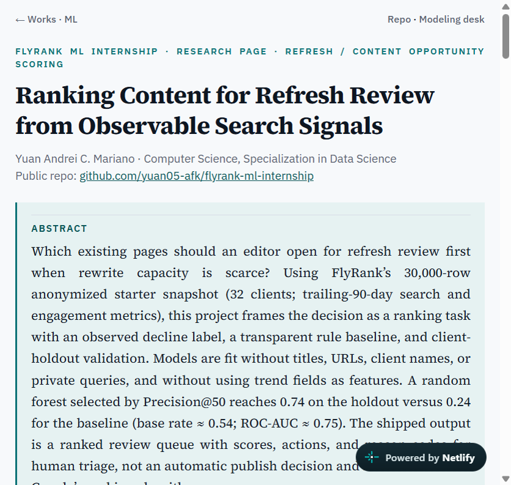
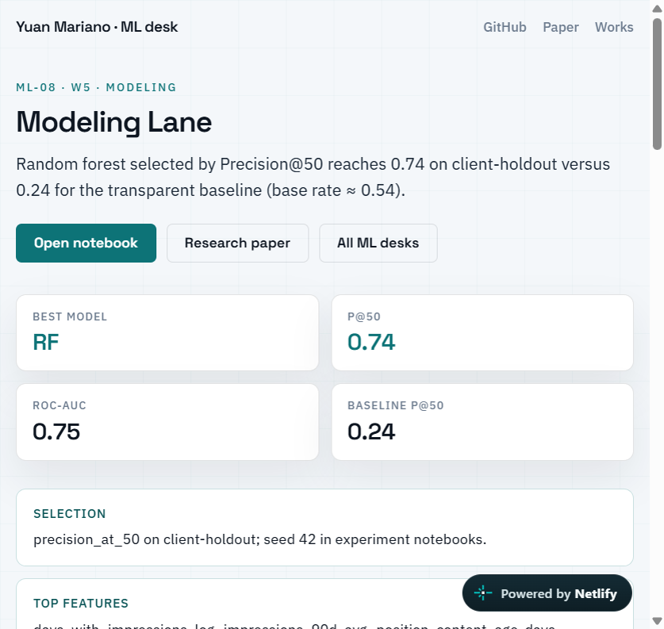
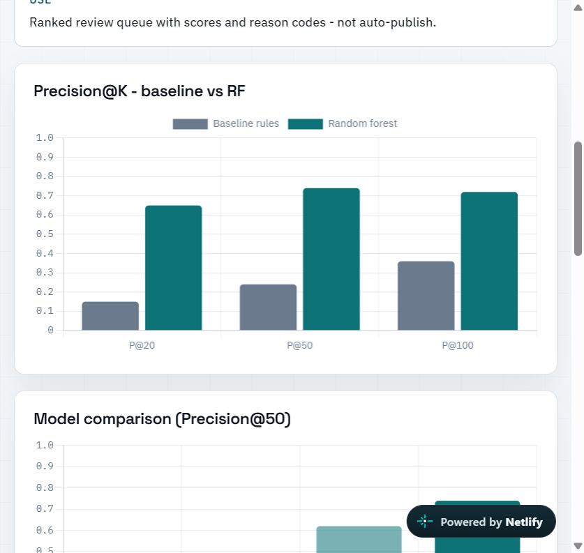
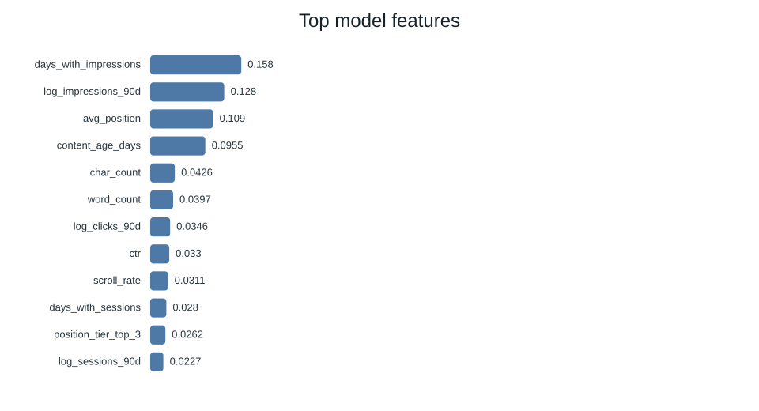
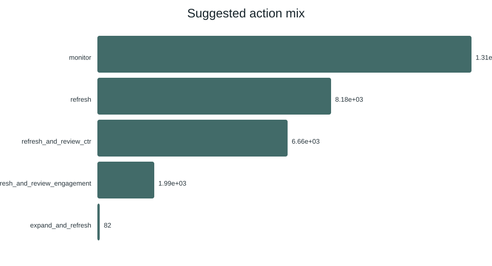
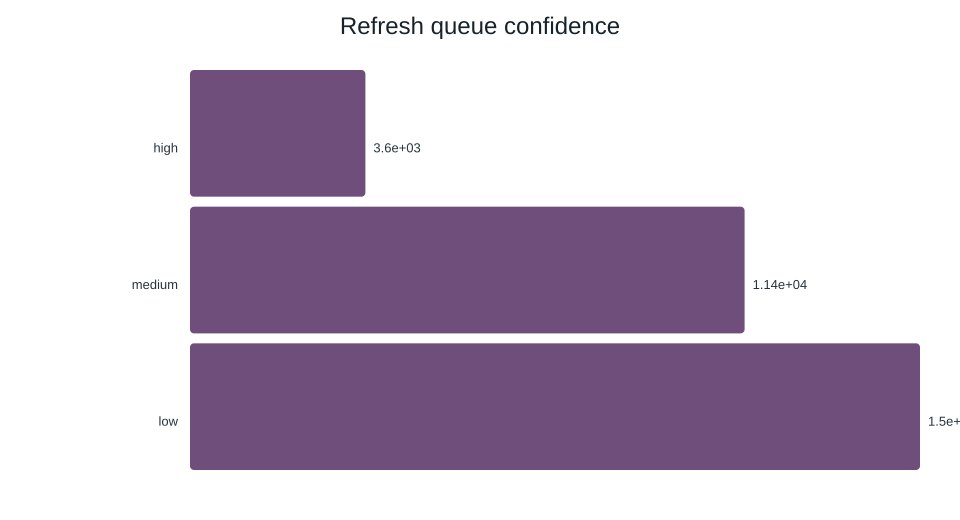
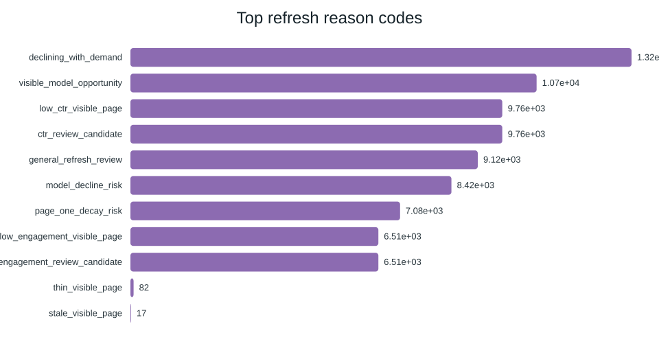
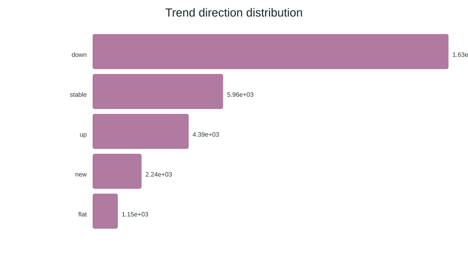

# Ranking Content for Refresh Review from Observable Search Signals

**Yuan Andrei C. Mariano** · CS (Data Science) · FlyRank ML Internship  
**Lane:** Refresh / Content Opportunity Scoring

When rewrite capacity is scarce, which existing pages should an editor open first? This repo ranks anonymized search pages into a **human triage queue** with scores, actions, and reason codes. It is decision-support, not auto-publishing, and not a claim about Google's ranking algorithm.

| Live surface | Link |
|---|---|
| Research paper | [yuan-mariano-works.netlify.app/ml/paper/](https://yuan-mariano-works.netlify.app/ml/paper/) |
| Modeling desk | [yuan-mariano-works.netlify.app/ml/ml-08-modeling/](https://yuan-mariano-works.netlify.app/ml/ml-08-modeling/) |
| All ML desks | [yuan-mariano-works.netlify.app/ml/](https://yuan-mariano-works.netlify.app/ml/) |
| Capstone report (source) | [`work/capstone_report.md`](work/capstone_report.md) |

<p align="center">
  <a href="https://yuan-mariano-works.netlify.app/ml/paper/">
    
  </a>
</p>

<p align="center">
  <a href="https://yuan-mariano-works.netlify.app/ml/ml-08-modeling/">
    
  </a>
</p>

---

## Headline result (client-holdout)

Measured on the bundled anonymized starter snapshot (`data/raw/content_refresh_anonymized.csv`): **30,000** pages · **32** clients · trailing-90-day aggregates.

| Metric | Value | Why it matters |
|---|---:|---|
| Declining-label base rate | **0.542** | Random guessing at the top of a queue is already ~54% |
| Baseline Precision@50 | **0.24** | Transparent hand rule (visibility + freshness + CTR gap) |
| Random forest Precision@50 | **0.74** | Selected model on the same client-holdout split |
| Random forest ROC-AUC | **0.75** | Ranking quality beyond the top-50 slice |
| Lift vs baseline P@50 | **~3×** | Same data, same split, honest comparison |

<p align="center">
  
</p>

Full comparison from the reference pipeline (`outputs/model_report.md`):

| Model | ROC AUC | Avg precision | Precision@50 | Recall | F1 |
|---|---:|---:|---:|---:|---:|
| decision_tree | 0.742 | 0.575 | 0.620 | 0.716 | 0.634 |
| logistic_regression | 0.700 | 0.522 | 0.400 | 0.567 | 0.566 |
| **random_forest** | **0.750** | **0.618** | **0.740** | **0.744** | **0.640** |
| baseline_rules | 0.627 | 0.468 | 0.240 | - | - |

> Read Precision@50 next to the **0.54** base rate. Beating chance is not enough. Beating the transparent baseline is the bar this project uses.

---

## What the model looks at

Trend fields define the decline label. They are **not** used as features (leakage rule). Top random-forest importances:



| Feature | Importance | Intuition |
|---|---:|---|
| `days_with_impressions` | 0.158 | Presence in search demand |
| `log_impressions_90d` | 0.129 | Volume of visibility |
| `avg_position` | 0.109 | How high the page already sits |
| `content_age_days` | 0.095 | Freshness / age risk |

These are signals an editor already reasons about, reweighted jointly.

---

## Shipped outputs (open these)

Run `python scripts/run_all.py` (or inspect the committed receipts):

| Artifact | What you get |
|---|---|
| [`outputs/model_report.md`](outputs/model_report.md) | Narrative report + tables |
| [`outputs/model_results.json`](outputs/model_results.json) | Machine-readable metrics |
| [`outputs/summary.json`](outputs/summary.json) | Compact headline numbers |
| [`outputs/refresh_queue.csv`](outputs/refresh_queue.csv) | Full ranked queue |
| [`outputs/refresh_queue_sample.csv`](outputs/refresh_queue_sample.csv) | First rows for quick inspection |
| [`outputs/flyrank_refresh_model_results.pdf`](outputs/flyrank_refresh_model_results.pdf) | Shareable PDF summary |
| [`outputs/charts/`](outputs/charts/) | SVG charts (action mix, confidence, reasons, features, trends) |

### Queue shape (reference run)

| Slice | Count |
|---|---:|
| Rows scored | 30,000 |
| High confidence | 3,602 |
| Medium confidence | 11,398 |
| Low confidence | 15,000 |
| Suggested `monitor` | 13,083 |
| Suggested `refresh` | 8,188 |
| Suggested `refresh_and_review_ctr` | 6,654 |
| Suggested `refresh_and_review_engagement` | 1,993 |
| Suggested `expand_and_refresh` | 82 |

### Top of the queue (preview)

Action codes tell an editor **what to do next**. Reason codes tell them **why**.

| Rank | Score | Prob | Action | Impressions | Trend |
|---:|---:|---:|---|---:|---|
| 1 | 81.6 | 0.78 | `refresh_and_review_ctr` | 12,834 | down |
| 2 | 81.4 | 0.79 | `refresh_and_review_ctr` | 8,064 | down |
| 3 | 81.4 | 0.85 | `refresh_and_review_ctr` | 2,498 | down |
| 4 | 81.0 | 0.77 | `refresh_and_review_ctr` | 13,790 | down |
| 5 | 80.9 | 0.81 | `refresh_and_review_ctr` | 3,393 | down |

Source: [`outputs/refresh_queue_sample.csv`](outputs/refresh_queue_sample.csv).

### Action and confidence mix

| Action mix | Confidence mix |
|:---:|:---:|
|  |  |

| Top reason codes | Trend distribution |
|:---:|:---:|
|  |  |

---

## Problem framing (one screen)

| Piece | Choice |
|---|---|
| **Decision** | Which pages open for refresh review this week? |
| **Unit** | One content item (page) |
| **Label** | Observed decline proxy (`trend_direction == down`); base rate ≈ 0.54 |
| **Split** | Client-holdout (unseen clients on test) |
| **Selection metric** | Precision@50 |
| **Baseline** | Transparent rules with reason codes |
| **Models** | Logistic regression, decision tree, random forest |
| **Output** | Ranked queue + action + reasons for humans |
| **Not claimed** | Google algorithm prediction · causal “refresh recovers traffic” |

Assignment notebooks live under [`work/notebooks/`](work/notebooks/) (`w01` … `w07` + `capstone`).

---

## Reproduce locally

```bash
git clone https://github.com/yuan05-afk/flyrank-ml-internship.git
cd flyrank-ml-internship
pip install -r requirements.txt
python scripts/run_all.py
```

Pipeline:

```text
01_prepare_features.py      clean + features + label
02_baseline_score.py        transparent rule score
03_train_model.py           LR / tree / RF + client-holdout
04_evaluate_and_export.py   queue + charts + Markdown report
05_build_pdf_report.py      PDF summary
```

Fast path (Colab, zero install):

[](https://colab.research.google.com/github/yuan05-afk/flyrank-ml-internship/blob/main/notebooks/01_first_look_and_discovery.ipynb?flush_cache=true)
 Week 1 discovery notebook

[](https://colab.research.google.com/github/yuan05-afk/flyrank-ml-internship/blob/main/notebooks/02_your_first_readable_model.ipynb?flush_cache=true)
 Week 2 readable model notebook

---

## Repo map

| Path | Role |
|---|---|
| `data/raw/content_refresh_anonymized.csv` | Public-safe starter (~30k rows) |
| `scripts/` | Reference pipeline |
| `outputs/` | Metrics, queue, charts, PDF |
| `work/notebooks/` | Filled assignment notebooks |
| `work/capstone_report.md` | Capstone narrative source |
| `docs/paper/` | Static paper mirror |
| `docs/readme/` | README peeks of the live site |
| `docs/data-dictionary.md` | Column meanings and gotchas |
| `SETUP.md` · `GUIDE.md` · `DATA_USE.md` | Setup, layout, data rules |

---

## Data safety

- Only the anonymized starter CSV ships here. No client names, domains, URLs, titles, or private queries.
- Do not commit private client extracts. See [`DATA_USE.md`](DATA_USE.md).
- Hugging Face `FlyRank/internship-warehouse` (~79M daily rows) is gated and was **not** used in this build. Access path is documented in [`SETUP.md`](SETUP.md).

---

## Honest limits

- Snapshot observed label, not a sealed future warehouse window.
- Starter sample size; warehouse deferred without HF credentials here.
- Results are measured / directional under holdout.
- No causal claim that refreshing recovers traffic.
- No claim of predicting Google's algorithm.

---

_Track: FlyRank Applied Search Intelligence · Author: Yuan Andrei C. Mariano · Code MIT · Data under `DATA_USE.md`_
